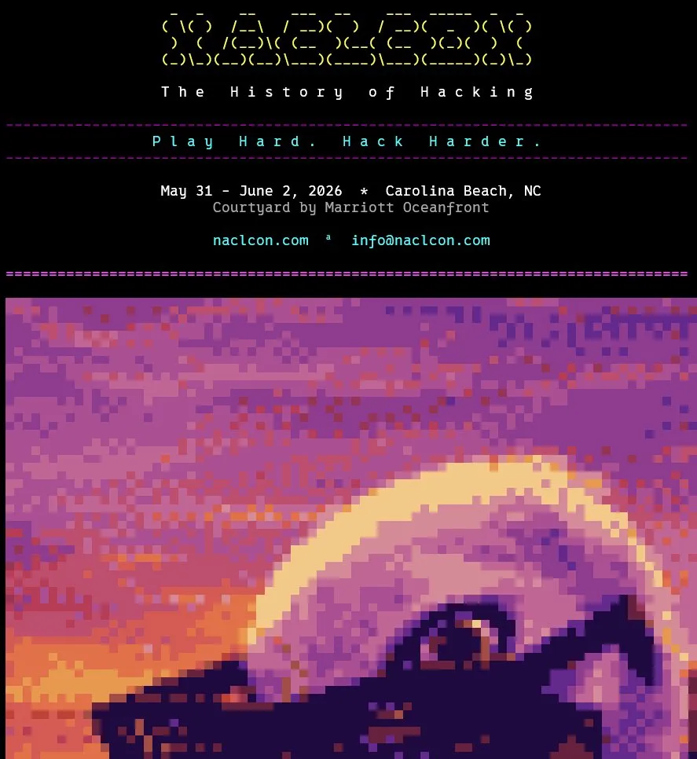

# NaClCON BBS



Unofficial bulletin board system for the [NaClCON 2026](https://naclcon.com) hacker conference, which ran May 31 - June 2, 2026 in Carolina Beach, NC. The con is over; the board stayed. It now runs year-round as the sysop's personal BBS with that weekend preserved as a read-only archive.

> Play Hard. Hack Harder.

> **Wording note:** the board describes itself as *unofficial*, never *semi-official*. It was closer to semi-official in practice, but some of the con organisers have since fallen out, and claiming any official standing risks taking a side. This is deliberate; please don't "correct" it.

## Connect

In your browser (no client needed: embedded fTelnet over WebSocket):

```
https://naclconbbs.net/
```

Via SSH:

```
ssh naclconbbs.net -p 2222
```

Via telnet:

```
telnet naclconbbs.net
```

> **Note (2026-04-17):** The BBS SSH host key on port 2222 was rotated. If your client warns about a changed host key, clear the old entry and re-trust. New fingerprint: `SHA256:YA9XC+4vgn0pAfe62evti5b2QnPQN4OIHo25QFUHvF0`

## Server

A Synchronet BBS (v3.21) running on AWS EC2 (Ubuntu 24.04). Spun up as a community hub for NaClCON attendees: message boards, file areas, chat, doors, and The Pelican.

- **Nodes**: 20 (supports 20 concurrent users). Post-con, the box is being downsized from t3.medium to **t3.micro** to cut cost while keeping the board on the air (see [Post-Con Operations](#post-con-operations))
- **Sysop**: foodbark
- **Library path**: `/sbbs/exec` is registered in `/etc/ld.so.conf.d/sbbs.conf` so `sbbs` can start via systemd. The binary has `$ORIGIN` in its RUNPATH but that expansion is unreliable for PIE binaries under systemd, leading to "library not found" errors. The ldconfig entry is the fix for this.

## Post-Con Operations

NaClCON ran May 31 – June 2, 2026. With the con over and ongoing traffic light, the board stays up year-round but on a smaller footprint. The goal of the cost-down is to keep everything that was built intact and reversible — nothing is torn down, only scaled down or paused.

**BBS box: t3.medium → t3.micro.** Synchronet's real memory footprint is ~966 MB, so it runs comfortably on a 1 GB instance once swap is in place. A 2 GB swapfile was added as a safety net before downsizing:

```bash
sudo fallocate -l 2G /swapfile
sudo chmod 600 /swapfile
sudo mkswap /swapfile && sudo swapon /swapfile
echo '/swapfile none swap sw 0 0' | sudo tee -a /etc/fstab
echo 'vm.swappiness=10' | sudo tee /etc/sysctl.d/99-swappiness.conf   # prefer RAM; spill only under real pressure
```

Resize procedure (console, ~2 min downtime): **Stop instance → change instance type to t3.micro → Start**. The static Elastic IP reattaches automatically on start, so DNS (`naclconbbs.net`) holds with no change. Synchronet self-starts via systemd and swap auto-mounts from `/etc/fstab`; confirm by dialing `ssh naclconbbs.net -p 2222`.

> **Heads-up on t3.micro:** memory-hungry interactive tooling (e.g. running an AI coding agent directly on the box) can OOM even with swap. Do large maintenance work *before* downsizing, or temporarily bump the instance type back up for the session, then return to micro.

**Analytics box: stopped, not terminated.** The separate Elastic Stack EC2 (Kibana dashboards + alerting) is *stopped* rather than running, which costs $0 in compute while preserving the EBS volume, all indexed sessions, the GeoIP pipeline, and the alert rules. Start it back up (~1 min) whenever the dashboards are needed. This loses *visibility* while paused, not *data* — the permanent session record lives in S3 (see [Logs](#logs)), and Kibana is only a viewer on top of it.

**Kept running regardless of analytics state:**

- **fail2ban** — actively bans scanners on its own; pausing the analytics box only silences the Kibana alerts, not the bans. The board stays internet-facing on 22/23/2222, so this stays on.
- **Synchronet onboard security** — login throttling, `.can` access lists, hack thresholds (see [Security](#security)).
- **S3 log sync cron** — keeps the off-box record continuous; negligible cost.

**Uptime alerting (independent of the analytics box).** With Kibana paused, the only signal that matters day-to-day is "is the board reachable at all?" That's covered by a [Healthchecks.io](https://healthchecks.io) dead-man's switch — a cron on the BBS box pings Healthchecks every 5 min, but *only* if sbbs is serving locally. Silence is the alarm: if the ping stops, Healthchecks notifies after the grace period.

```bash
# crontab (ubuntu). Replace <your-uuid> with the real check UUID — that ping
# URL is effectively a credential, so keep it out of this repo and anywhere shared.
*/5 * * * * /usr/bin/curl -fsS -m 10 -k -o /dev/null https://localhost/ && /usr/bin/curl -fsS -m 10 -o /dev/null https://hc-ping.com/<your-uuid>
```

Set the check to **period 5 min / grace ~10 min** and point its notification at email or a phone push. The local `https://localhost/` check verifies sbbs is actually *serving* (catches a crashed or hung process), and the cron failing to run at all covers the box being down or off the network.

> **Blind spot:** because the check runs *from* the box, it can't detect a purely *inbound* break (e.g. a fat-fingered security group or DNS change) while the box and sbbs are otherwise healthy. That case is rare and self-inflicted. If you want it covered too, add an external poller (e.g. UptimeRobot) hitting `https://naclconbbs.net/` from outside — note the box **cannot** check its own public URL, since EC2 doesn't hairpin traffic to its own Elastic IP.

## The Post-Con Conversion (July 2026)

Turning a conference board into a year-round personal one. Ops (cost-down, alerting) is above; this is the content and behaviour side.

### The stuck countdown

Both Pelican modules carried a countdown to the con that computed `days = ceil(conf - now)` and fell into its `days <= 0` branch permanently once the con passed, injecting *"The conference is happening RIGHT NOW"* into every system prompt from June 3 onward. It is now a count **up** from the closing day (2026-06-02), phrased in bands (days → weeks → months → years) so it stays readable forever with no date string to maintain:

```js
var days = Math.floor((now - ended) / 86400000);
```

Retensed alongside it: `text/welcome.msg`, `data/msgs/auto.msg`, `text/sbbs.msg`, `text/naclcon-readme.msg`, and the `NACLCON ITSELF` section of `ctrl/pelican_local.txt`, which separately told her the con was running and that everyone online was probably an attendee.

### The NaClCON 2026 archive wing

The five con sub-boards (CTF, Talks, Villages, Swap Shop, After Hours) moved out of the `Local` group into a dedicated `[grp:NaClCON2026]` ("NaClCON 2026 Archive") with `post_ars=SYSOP`. They stay fully readable; nobody but the sysop can post.

> **Critical gotcha when regrouping subs.** A sub's internal code is the group's `code_prefix` **plus** the ini section suffix, and the message base filename derives from that code. `[grp:Local]` has `code_prefix=LOCAL-`, so `[sub:Local:CTF]` is code `LOCAL-CTF` living in `data/subs/local-ctf.*`. The archive group therefore **deliberately reuses `code_prefix=LOCAL-`**. Any other prefix would have renamed the bases and orphaned every message in them. Duplicate prefixes across groups are fine as long as the resulting full codes stay unique.

### BullsEye config format

`mods/bullseye.js` (which overrides the stock module) gained two `text/bullseye.cfg` features so the bulletin menu can have sections:

| Line form | Meaning |
|-----------|---------|
| `# Some Header` | Non-selectable section header; consumes no number |
| `../text/foo.msg` | Bulletin, label derived from filename (original behaviour) |
| `../text/foo.msg\|Nice Label` | Bulletin with an explicit menu label |

Numbering skips headers and stays continuous across sections. The first line remains the print-mode expression (`P_SEEK`). This is also how `schedule.msg` finally got listed; it had existed in `text/` all along but was never in the config, so it was unreachable.

### The Pelican moved to Missoula

The sysop relocated and the board went with him, so she did too. She is still a Carolina Beach pelican, now living in a mountain valley ~700 miles from salt water and grumbling about it affectionately. Her knowledge is split by *where*, not just *what*:

- `ctrl/pelican_local.txt`: **where she is from.** Reframed rather than rewritten: a new preamble declares the whole file memory of home water, so ~200 lines of restaurant and beach lore stay useful as things she knows by heart instead of directions to a boardwalk nobody is standing on.
- `ctrl/pelican_missoula.txt`: **where she is now.** Rivers and confluences, the M on Mount Sentinel, Brennan's Wave, food and beer, smokejumpers, inversions and smoke season, and a bird-to-bird rivalry with the local ospreys.

See [The Pelican](#the-pelican) for the full knowledge-surface list.

### Rebrand to foodbark (in progress)

The board is becoming **foodbark**, the sysop's personal BBS, with NaClCON kept as a memorial rather than an identity. The logon splash is done; the rest of the copy and config still say NaClCON BBS.

Both splash files (`text/logon.asc` plain pre-auth, `text/menu/logon.asc` coloured post-auth) now show the foodbark wordmark hard left in bright magenta, `Formerly...` set out to the right, and the NaClCON logo beneath it **dimmed to dark gray**, so the handover reads visually instead of two logos competing. The con's dates, venue, `naclcon.com` line and "Play Hard. Hack Harder." are dropped; "The History of Hacking" stays as part of the memorial. Both files land at 22 rows including the conditions strip, inside the 24-row budget so nothing scrolls off an 80x24 terminal.

> Any edit to these two files **must leave the last all-`=` line as the final content line**. `scripts/pelican_weather_tides.py` truncates at that separator and appends the conditions strip after it; move or lose it and the strip lands in the wrong place or the file grows on every cron run. The build script asserts this.

Still carrying NaClCON branding: `text/logo.asc`, `text/sbbs.msg`, `text/newuser.msg`, `text/welcome.msg`, the webv4 frontend, lbshell theming, the BBS name in `ctrl/sbbs.ini` / `ctrl/main.ini`, and `[qwk] default_tagline` in `ctrl/msgs.ini` (which rides out on every DOVE-Net message). The NaClCON colour palette is deliberately **kept**.

#### Planned: bbs.foodbark.io

`foodbark.io` is already owned. The intent is a `bbs.foodbark.io` subdomain pointing here alongside `naclconbbs.net`, with both resolving to the same board.

> **DNS alone is not enough.** The TLS certificate must include the new hostname or `https://bbs.foodbark.io` throws a certificate warning, which is a worse first impression than not having the domain at all. Certs are issued by Synchronet's built-in `exec/letsyncrypt.js`, so the new name has to be added to the hostname list in `ctrl/sbbs.ini` and a renewal run, ideally in the same change as the DNS record. Telnet and SSH are unaffected; this only touches the web frontend and the fTelnet browser terminal.

When it lands, the splash footer becomes a two-domain line (currently `Missoula, Montana  *  naclconbbs.net`).

### Conditions strip

The logon splash and the Lightbar status row both carry a one-line conditions strip built from `data/weather_tides.txt`:

```
  Missoula | 71F | Precip 0% | AQI 113 | 0mph | Clark Fork 1820cfs
```

Tides and the two NDBC surf buoys are gone with the move inland. Wind took one freed slot (it rides along with the NWS hourly forecast already being fetched, so it costs no extra request); **Clark Fork river flow** took the other. AQI **replaced the EPA UV index**, because in a valley that spends August and September under wildfire smoke, particulate is the number people actually want.

| Field | Source | Notes |
|-------|--------|-------|
| Temp / Precip / Wind | NWS `api.weather.gov` | Wind direction is legitimately absent when calm |
| AQI + PM2.5 | Open-Meteo air quality | No API key |
| River flow / stage / water temp | USGS gauge `12340500` | "Clark Fork above Missoula", the in-town gauge |

> **Gauge choice matters.** `12340500` ("above Missoula") is the in-town gauge, the one reflecting the water at Brennan's Wave. `12353000` ("below Missoula") sits downstream of the Bitterroot confluence and reads substantially higher. Don't swap them casually.

AQI is coloured by the six [AirNow categories](https://www.airnow.gov/aqi/aqi-basics/), because a bare number doesn't read as good or bad at a glance:

| AQI | Category | AirNow | Rendered |
|-----|----------|--------|----------|
| 0–50 | Good | Green | bright green |
| 51–100 | Moderate | Yellow | bright yellow |
| 101–150 | Sensitive Groups | Orange | **brown** (no orange in a 16-colour palette) |
| 151–200 | Unhealthy | Red | bright red |
| 201–300 | Very Unhealthy | Purple | bright magenta |
| 301+ | Hazardous | Maroon | **dark red** (no maroon either) |

> **Two renderers, keep them in sync.** `render_weather_strip_color()` / `_plain()` in `scripts/pelican_weather_tides.py` writes the strip into the logon splash files; `nc_weather_strip()` in `mods/lbshell.js` draws the same strip live on the status row. Change one, change the other, then diff their visible output against the same snapshot.
>
> They differ in exactly one respect, on purpose. Brown and dark red are the only codes needing `\x01n` to clear the high-intensity bit, and per the Synchronet source `\x01n` also clears the **background**. The lbshell status row is painted `console.attributes=0x5F` (magenta background) so it re-asserts `\x015` after the reset; the logon splash draws on a normal background and omits it. Hence `aqi_colour(aqi, bg)`.
>
> **Width budget:** six fields fit 79 columns with little room. Worst realistic case (sub-zero, high precip, gusty with direction, spring runoff at five digits) measures 76. A seventh field will wrap an 80-column terminal. A planned winter change swaps Clark Fork cfs for Snowbowl snow depth as a *swap*, not an addition, for this reason.

Known rough edge: Very Unhealthy renders bright magenta on the magenta status row, the weakest contrast of the six. The pipes have the same issue already, so it is pre-existing rather than new.

## AWS Security Group — Required Open Ports

| Port | Protocol | Service | Notes |
|------|----------|---------|-------|
| 22 | TCP | OS SSH | Restrict to sysop IP only |
| 23 | TCP | Telnet (public) | Open to all |
| 2222 | TCP | BBS SSH (public) | Open to all |
| 80 | TCP | HTTP | Open to all |
| 443 | TCP | HTTPS | Open to all |
| 1123 | TCP | WebSocket | Open to all |
| 11235 | TCP | WebSocket TLS | Open to all |
| 24554 | TCP | BinkP (FTN mailer) | Open for fsxNet inbound. Service activates after node assignment |

> FTP (21), Gopher (70), and NNTP (119) are configured but currently disabled.
> To re-enable: set `AutoStart = true` (FTP, `ctrl/sbbs.ini`) or `Enabled=false` → `true`
> (Gopher/NNTP, `ctrl/services.ini`), then open the corresponding port in the Security Group.

Also considering adding email server back in (can of worms though it is) as it is prominently featured in Synchronet and in the default shell.

## Status

- [x] SSH access on port 2222
- [x] Telnet access on port 23
- [x] New user registration (custom prompts: handle/alias, optional real name, optional email for password reset / mail forwarding, location, no gender or birthday; case preserved as typed)
- [x] NaClCON branding throughout
- [x] Local message boards
- [x] Chat, file areas, external doors
- [x] Security hardening (see below)
- [x] Shell restricted to Synchronet Classic + Deuce's Lightbar Shell; **Lightbar Shell is the default** for new users (ANSI/80-col terminals; others fall back to Classic)
- [x] NaClCON color palette applied to both shells
- [x] The Pelican: Claude-powered AI chat bot (1-on-1 and multinode)
- [x] **NaClCON 2026 archive wing**: con sub-boards regrouped and frozen read-only, bulletins sectioned (see [The Post-Con Conversion](#the-post-con-conversion-july-2026))
- [x] **Pelican relocated to Missoula, MT** with split origin/current knowledge files
- [x] **Conditions strip** on logon + Lightbar status row: NWS weather, AirNow-coloured AQI, Clark Fork river flow
- [x] Speaker list bulletin and per-speaker message threads
- [x] Pre-login NaClCON banner shown at connect (before login prompt, via `mods/login.js`)
- [x] Terminal-adaptive splash art at logon (wide ANSI art for large terminals >80 col, narrow art for 80-col terminals like SyncTERM; see `mods/logon.js`)
- [x] Hacker Archives file area (F → Hacker Archives): Phrack 24 + 72, LOD/H Technical Journal Issues 1–4, L0pht/Weld Pond advisories (see below)
- [x] External doors — **NaClCON Arcade** (15 doors: Synchronet Minesweeper + 14 A-Net classics) and **Apps & Info** (Weather, X-News, NewsCenter); see below
- [x] **BBSes We Like** — curated connect menu (`mods/exec/bbslike.js`) that telnet-gateways into a handpicked list of other boards from inside NaClCON
- [x] `naclconbbs.net` DNS live (A → static Elastic IP)
- [x] **Web frontend** (Synchronet webv4) live at `https://naclconbbs.net/` with NaClCON branding (custom CSS, header, dark mode default, favicon pulled from naclcon.com)
- [x] **HTTPS** via Let's Encrypt — issued and renewed by Synchronet's built-in `exec/letsyncrypt.js` (HTTP-01 webroot challenge); daily cron at 04:17 UTC, no-ops until cert has <1/3 lifetime left
- [x] **Browser terminal (fTelnet)** embedded on the home page, connects via WebSocket over TLS to port 11235
- [ ] fsxNet (Zone 21) FTN integration: application sent, awaiting node assignment; will bring echomail + netmail (see below)
- [ ] CTF-related content
- [ ] Local custom doors (The Clans port)

## Color Scheme

NaClCON brand palette mapped to CGA 16-color terminal codes:

| Color | CGA Index | Escape Code | Use |
|-------|-----------|-------------|-----|
| Bright Magenta | 13 | `\x1b[1;35m` | Primary accent |
| Dark Magenta | 5 | `\x1b[35m` | Secondary accent |
| Bright Red (hot pink) | 9 | `\x1b[1;31m` | Highlight |
| Dark Red | 1 | `\x1b[31m` | Dim highlight |
| Bright Yellow | 11 | `\x1b[1;33m` | Info / emphasis |
| Dark Yellow | 3 | `\x1b[33m` | Dim info |
| Bright White | 15 | `\x1b[1;37m` | Body text |
| Light Gray | 7 | `\x1b[37m` | Dim text |
| Dark Gray | 8 | `\x1b[1;30m` | Subtle / borders |
| Black | 0 | `\x1b[30m` | Background |

In Synchronet `\x01` (Ctrl-A) color codes: `\x01h\x01m` = bright magenta,
`\x01h\x01r` = hot pink, `\x01h\x01y` = bright yellow.

**Synchronet Classic: header (`text/menu/head.msg`)**
- Box borders: `\x01h\x01m` (bright magenta)
- BBS name: `\x01h\x01y` (bright yellow)
- Time/date: `\x01h\x01w` (bright white)
- Labels: `\x01h\x01w` (bright white)
- Values (last on, uptime): `\x01c` (cyan)

**Duce's Simple Shell menus (`text/menu/simple/`)**
- Box borders: `\x01h\x01m` (bright magenta)
- BBS name: `\x01h\x01y` (bright yellow)
- Hotkeys: `\x01h\x01y` (bright yellow)
- Menu text: `\x01h\x01w` (bright white)
- Box background: `\x015` (magenta)

## Security

### The Jamaican

Shortly after the BBS went live, `34.212.124.156` (`ec2-34-212-124-156.us-west-2.compute.amazonaws.com`) opened a number of simultaneous HTTPS connections in a single second, probing for weak TLS (SSLv2, TLSv1.0, TLSv1.1). Synchronet rejected all of them: no downgrade was possible. Seems like a scriptkiddy with an AWS account and a TLS scanner. I fat-fingered the IP in my initial recon and geolocated to Jamaica. I looked up the IP and it had already been reported on [abuseipdb.com](https://www.abuseipdb.com/check/34.212.124.156).

```
3/17 17:56:34 web  0044 HTTPS [34.212.124.156] Connection accepted on 172.31.24.94 port 443 from port 35815
3/17 17:56:34 web  0045 HTTPS [34.212.124.156] Connection accepted on 172.31.24.94 port 443 from port 25147
3/17 17:56:34 web  0046 HTTPS [34.212.124.156] Connection accepted on 172.31.24.94 port 443 from port 33376
3/17 17:56:34 web  0044 TLS WARNING 'Server sent handshake for the obsolete SSLv2 protocol' (-13) setting session active
3/17 17:56:34 web  0046 TLS WARNING 'Invalid version number 3.1, should be at least 3.3' (-32) setting session active
3/17 17:56:34 web  0050 TLS info 'No encryption mechanism compatible with the remote system could be found' (-20) setting session active
```

IP added to `text/ip-silent.can`. Connections now dropped silently before Synchronet wakes up.

Of course, this incident was just the begining.  While it has been followed by significant system hardening the server continutes to be hammered by bots.

### Hardening Applied
- AWS Security Group: port 22 (OS SSH) restricted to sysop IP only
- OS SSH: password authentication disabled (key-only)
- `ufw` enabled with default-deny inbound, rate limiting on port 443
- `fail2ban` running with six jails: `sshd`, `sbbs-passwd`, `sbbs-scanner`, `sbbs-shadow`, `sbbs-web404`, `synchronet-bbs`
- UFW manual blocks (positions 1–4): four confirmed scanner IPs that never authenticated: `194.26.192.152`, `34.6.93.227`, `223.123.124.177`, `141.98.11.181`
- Synchronet login throttling (`ctrl/sbbs.ini`):
  - Delay between attempts: 5s; per-attempt throttle: 2s
  - Hack threshold: 5 attempts
  - Temp ban: after 20 attempts, 15 min duration
  - Permanent filter: after 50 attempts, 24h duration
- IP blocklist: `text/ip-silent.can` connections silently dropped before Synchronet wakes up

### fail2ban

Six jails are active. The original five are configured in `/etc/fail2ban/jail.d/sbbs.conf`; `synchronet-bbs` is in `/etc/fail2ban/jail.d/synchronet.conf`:

| Jail | Watches | Trigger | Ban |
|------|---------|---------|-----|
| `sshd` | `/var/log/auth.log` | OS SSH brute force (default Debian config) | default |
| `sbbs-passwd` | `/sbbs/data/hack.log` | HTTP request for `/etc/passwd` | 1 hit → 1hr |
| `sbbs-shadow` | `/sbbs/data/hack.log` | HTTP request for `/etc/shadow` | 1 hit → 24hr |
| `sbbs-scanner` | `/sbbs/data/hack.log` | Any other web path traversal outside web root | 3 hits/week → 24hr |
| `sbbs-web404` | systemd journal (`_COMM=synchronet`) | 5+ HTTP 404s in 1hr (bot probes, scanner sweeps) | 5 hits/hr → 24hr |
| `synchronet-bbs` | `/var/log/syslog` | SSH session establishment failures (BBS port 2222) | 10 hits/2min → 24hr |

The `sbbs-passwd/shadow/scanner` jails key off Synchronet's `hack.log` (path traversal attempts outside the web root). `sbbs-web404` reads directly from the systemd journal and catches the lower-level bot activity that never reaches `hack.log`  scanners probing for `/admin/`, `/.git/config`, `serverConfig.json`, etc. Filter is in `/etc/fail2ban/filter.d/sbbs-web404.conf`.

The idea is slap on the wrist for looking around, harder slap if you are after /etc/shadow, full ban if you are trying to bruteforce the OS.

### Logs

To stay on top of activity without being logged into the server, all logs are synced off-box to S3 every minute via `/home/ubuntu/bin/s3_log_sync.sh` (cron). S3 bucket: `s3://naclcon-bbs-dead-drop/`. BBS logs land in `bbs-logs/`, system logs in `system-logs/<hostname>/`. An Elastic Stack instance on a separate EC2 ingests from S3 for dashboards and alerting. **Post-con this instance is stopped to save cost** (see [Post-Con Operations](#post-con-operations)) — the S3 record keeps accumulating regardless, and the box can be restarted in ~1 min when the dashboards are wanted again.

| File | Contents |
|------|----------|
| `/sbbs/data/logs/MMDDYY.log` | Daily BBS activity (logins, sessions, file transfers, events) |
| `/sbbs/data/logs/MMDDYY.lol` | Daily session summary (user, node, times, stats) |
| `/sbbs/data/logs/http-MMDDYY.log` | HTTP access log (one line per web request) |
| `/sbbs/data/hack.log` | HTTP/HTTPS hack attempts (path traversal, `/bin/sh`, etc.) |
| `/sbbs/data/hungup.log` | Users who disconnected mid-session |
| `/var/log/auth.log` | OS SSH logins, sudo, PAM authentication |
| `/var/log/ufw.log` | Firewall blocks and allows |
| `/var/log/fail2ban.log` | Brute-force attempts and bans |
| `/var/log/syslog` | General OS events |

Log verbosity: the terminal server (`[BBS]`) logs at `Debugging` level to capture file transfer details. All other servers (Web, Services) log at `Info`.

The systemd journal is capped at **50M / 2-day retention** (`/etc/systemd/journald.conf`). Logs are shipped to S3 for further analyis so there is no reason to keep them on disk long-term. Bot traffic (web 404 probes) was the primary journal bloat driver before `sbbs-web404` was added.

### SSH Login Behavior (SSH_ANYAUTH)

`SSH_ANYAUTH` is currently enabled in `ctrl/sbbs.ini`. This makes the SSH server accept any credentials without checking them, which means every user, new and returning, goes through the full BBS login sequence (username/password prompt + logon screens).

**Before this change:** `ssh username@host -p 2222` auto-logged returning users in at the SSH layer. No BBS login prompt.

**Why it was added:** New users connecting via SSH were being rejected before reaching the BBS because their SSH clients weren't sending credentials the server would accept.

**Trade-off:** New user signup works reliably. Returning users have a clunkier experience (no fast logon).

**TODO:** Figure out the root cause of the new-login failures without `SSH_ANYAUTH`, then revert. Returning users with BBS credentials provided at the SSH level (or SSH pubkeys registered in their BBS account) should auto-login without it.

## Hacker Archives

A file area accessible via **F → Hacker Archives** from the main menu. Files are viewable inline (V) or downloadable. Promoted via the welcome screen (`data/msgs/auto.msg`), the BullsEye bulletin (`text/hacker_archives.msg`), and a sysop post in LOCAL-NOTICES.

The file area config lives in `/sbbs/ctrl/file.ini` (not in this repo: edit directly on the server). Files are stored under `/sbbs/data/dirs/`. Use `/sbbs/exec/jsexec addfiles.js -lib="Hacker Archives" FILES.BBS -v` to register new files after dropping them in a directory.

### Phrack Magazine

| Directory | Content |
|-----------|---------|
| `phrack/` | Issue 24 (Feb 1989):  13 philes including the legendary E911 article ("Control Office Administration of Enhanced 911 Service" by The Eavesdropper) that triggered Operation Sundevil and the founding of the EFF |
| `phrack/` | Issue 72 (Aug 2025): 19 philes including PHP exploitation, macOS IOKit, Rsync RCE, CPU backdoors, Gera prophile, Hacker's Renaissance manifesto |

Downloaded via `https://archives.phrack.org/tgz/phrack{N}.tar.gz`.

### LOD/H Technical Journal

Issues 1–4 complete (1987–1990). The most technically rigorous hacker publication of the BBS era.

**NaClCON speaker connection:** NaClCON speaker **Izaac Falken** is **Professor Falken** of LOD/H. Issue 4 contains his article "The Radar Guidebook." His handle comes from the WarGames character. LOD/H TJ articles were also published in 2600 Magazine, where Izaac is also credited.

Key extracts available as standalone files:
- `lodh4_03_radar_guidebook_professor_falken.txt`: authored by NaClCON speaker Izaac Falken
- `lodh4_06_history_of_lodh.txt`: LOD/H retrospective
- `lodh3_10_clearing_up_busts.txt`: debunking the mythical LOD/H busts

### L0pht Heavy Industries

NaClCON speaker **Chris Wysopal (Weld Pond)** was a core L0pht member. Files:
- `weld_pond_smb_auth_vuln_1999.txt`:  Win95/98 SMB challenge-reuse authentication vulnerability (Bugtraq, Jan 1999)
- `weld_pond_clipart_overflow_2000.txt`:  MS Office 2000 ClipArt Gallery stack overflow (Bugtraq, Mar 2000)
- `jericho_mudge_obp_forth_phrack53_1998.txt`: Jericho's post on Mudge's Sun OBP/FORTH root hack from Phrack 53 (Bugtraq, Jul 1998). Jericho is also a NaClCON speaker.

### Zines

2600 Magazine and Blacklisted! 411 issues: being populated. Izaac Falken and Brian Harden (noid) are both tied to 2600 but it's hard to find text versions of them.

## External Doors (A-Net Online Passthrough)

Classic BBS door games via rlogin passthrough to [A-Net Online](https://a-net-online.lol/gameserver): a dedicated door hub with 450+ games at `game.a-net-online.lol:513`. No local install; games run on A-Net and state (scores, characters) lives there. Each door is wired as a Synchronet external program in `ctrl/xtrn.ini` that rlogins with our BBS tag `-s-nacl`.

Two sections are exposed from the **External Programs** menu:

**NaClCON Arcade** (15 doors): Synchronet Minesweeper (local), LORD 4.08, NukeWars 3.8, Buccaneer, Darkness, Netrunner, High Seas, Synchronetris, Operation Overkill II (Omega & Deathland), Trade Wars 2002, Drug Lord, Video Poker, The Clans (777 InterBBS), NetHack.

**Apps & Info**: Weather Center, X-News, NewsCenter.

To add more entries, append `[prog:ARCADE:CODE]` (or `APPS`) blocks to `ctrl/xtrn.ini` using the existing template: full A-Net game code list at https://a-net-online.lol/gameserver.

## fsxNet - FidoNet-Style Echomail

NaClCON BBS is joining [fsxNet](https://fsxnet.nz/) - the **F**un, **S**imple, e**X**perimental FTN network in Zone 21. Open-enrollment and retro-adjacent, it fits the con's ethos better than real FidoNet Zone 1 (which would require Policy4 commitment and weeks of coordinator back-and-forth).

**Status (2026-04-22):** Application sent to Paul Hayton (Avon, `avon@bbs.nz`). CRASH mode. BinkP on `naclconbbs.net:24554` (UFW and AWS SG both open). Awaiting node assignment.

**Once active**, the BBS will carry a curated set of echomail areas: `FSX_GEN`, `FSX_BBS`, `FSX_RETRO`, `FSX_CRY`, `FSX_TST`. Netmail will flow both ways. Scaffolding happens via `/sbbs/exec/init-fidonet.js 21` once I get the creditials creating the FidoNet message group in SCFG, downloads the fsxNet echolist, installs `binkit.js` as an event, and fires off an AreaFix subscription netmail.

## The Pelican

The Pelican is the BBS chat bot: a sassy southern coastal Peli-hen who knows her way around a terminal. Powered by the Claude API (Haiku model). Best experienced in SyncTERM (syncterm.bbsdev.net).

Since July 2026 she lives in **Missoula, Montana**, having followed the sysop and the board inland from Carolina Beach. She is still a Carolina Beach pelican and says so; the mountains are an affectionate running grievance, not a new identity.

**1-on-1 chat** (`mods/pelican.js`): accessible via the 'T' key in both shells. Maintains per-user conversation history across sessions in `data/user/pelican_NNNN.json`. Config (API key, model, token limits) in `ctrl/pelican.ini` (gitignored). In private chat she gives longer, lore-heavy responses (3-5 sentences) and wraps text to your terminal width.

**Multinode chat** (`mods/multichat_pelican.js`): a full JS reimplementation of Synchronet's built-in multinode chat that layers in Pelican responses. She chimes in when addressed by name (`pelican` / `peli`) or when there are 3 or fewer users in the channel. Shared Pelican history in `data/user/pelican_chan.json`. The chat menu is at `text/menu/multchat.msg` (NaClCON-branded, multi-color).

The room has a rolling **persistent scrollback** of the last 90 broadcast lines, stored at `/sbbs/data/multichat_scrollback.txt` and replayed under a `── scrollback ──` header to anyone who joins, so people drifting in mid-conversation see context. Whispers are private and excluded.

Slash commands: `/W <alias> <text>` whispers to one online user (alias-matched), `/L` lists who's currently in the room, `/Q` exits, `/?` re-shows the menu. `^U` and `^P` pass through to Synchronet's built-in user list and private-message dialogs. Chat scrolls continuously without paginate-prompts.

**Persona & knowledge:** She's warm but sassy, drops a "hun" or "darlin'" occasionally (hard cap: one per response, skipped in most). She knows the NaClCON 2026 details (speakers, schedule, venue) and speaks about the con in the **past tense**, pointing people at the on-board archive; the NaClCON Arcade door lineup; and the BBSes We Like curated list.

> **Dialect note:** when a g drops off an `-ing` word she never writes the apostrophe (`fixin`, not `fixin'`), because the apostrophe reads theatrical. Real contractions (`y'all`, `ain't`) keep theirs. She is also instructed never to use em-dashes or double-hyphens, which read as AI tells. Her canonical texts: every issue of Phrack (phrack.org), The Hacker's Manifesto (The Mentor, 1986, Phrack #7), the DoD Rainbow Series (Orange Book/TCSEC, Password Management Guideline, TCSEC Application Guidance, Computer Security Glossary), and Neuromancer (Gibson, 1984).

**Dynamic knowledge surfaces** (appended to her system prompt every chat session):
- `ctrl/pelican_news.txt` — static BBS-state facts (Hacker Archives, Arcade, BBSes We Like, menu layout). Hand-edited.
- `ctrl/pelican_weather.txt`: live conditions for **Missoula**: NWS forecast, AirNow-category air quality, and the Clark Fork river (flow, stage, water temp). Refreshed every 30 minutes by `scripts/pelican_weather_tides.py` (cron). Gitignored. She references current conditions organically when asked; the prompt specifically instructs her not to recite unprompted.
- `ctrl/pelican_local.txt`: **where she is from.** Carolina Beach & Kure restaurants (curated from Wilmington-subreddit threads), local secrets and rituals (Venus flytraps at the State Park, Freeman Park 4x4 etiquette, Thursday night fireworks, Sunday movie nights at the Lake), Pleasure Island history (1857 founding, Hurricane Hazel, the boardwalk's golden age, Freeman family legacy at the north end, Fort Fisher), and NC hacker history (Mitnick's 1995 Raleigh capture, the BBS underground, the December 2025 BEC attack on the town itself, NaClCON's "Salt Con" framing). Since July 2026 the file's preamble frames all of it as **memory**, so she talks about the coast as a place she knows by heart rather than one she is standing in.
- `ctrl/pelican_missoula.txt`: **where she is now.** The Clark Fork and its confluences, the M on Mount Sentinel, Brennan's Wave, the food and beer worth naming, the smokejumper base, inversions and smoke season, Snowbowl and Flathead Lake, and a bird-to-bird rivalry with the local ospreys. Hand-edited.

Both location files are loaded, in the order `naclcom → local → missoula → news`, so she can hold "I'm from there, I live here" without confusing the two. She picks one or two relevant items rather than reciting.

> The script is still named `pelican_weather_tides.py` even though Montana has no tides. The name is kept so the crontab entry doesn't need touching; don't be misled by it, and don't rename it without updating cron.

## Logon Splash Art

At logon, `mods/logon.js` displays a random piece of ANSI art chosen based on the user's terminal width:

- **>80 columns**  a random `random_wide*` file is served via `cat` (using `EX_STDIO | EX_NATIVE` so the raw bytes pass through unmodified)
- **≤80 columns** (e.g. SyncTERM, standard 80-col terminals): a random `random_narrow*` file is served via `bbs.menu()`

Art files live in `text/menu/` and deploy to `/sbbs/text/menu/` via rsync:

| File | Type |
|------|------|
| `random_narrow_closeup02.ans` | Narrow |
| `random_narrow_logo.ans` | Narrow |
| `random_wide_1XXXX.ans` | Wide |
| `random_wide_XXXXX.ans` | Wide |
| `random_wide_closeup.ans` | Wide |

Source art files (pre-rename) are in `art/`. To add more, drop a file matching `random_wide*` or `random_narrow*` into `text/menu/` and rsync to deploy. The logon module picks from all matching files at random.

## Sysop

foodbark (Benjamin Hausmann): send feedback from inside the BBS or open an issue here.

## Contributing

This is a community BBS for a hacker con. If you want to help:
- Open an issue or PR
- Or just connect to the BBS and leave feedback via the message boards I will try to watch them.
